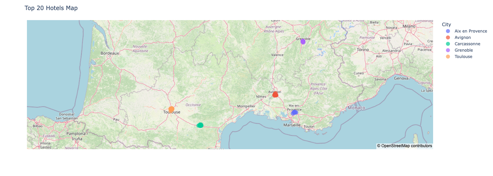

# CDSD (Jedha) — Bloc 1 · Data Infrastructure · Kayak / Booking

Data Lake → Data Warehouse pipeline that ranks **French destinations** using **7-day weather** + **hotel** data, with **interactive maps**.

---

## 📇 Company (context)
**Kayak** is a global travel metasearch owned by **Booking Holdings** (Booking.com, Kayak, Priceline, Agoda, RentalCars, OpenTable), ~$300M+ revenue.

---

## 🚧 Project
User research: **70%** of trip planners want richer **destination info** and trust well-known brands.  
We prototype an app that ranks destinations & hotels on a rolling **7-day** horizon using weather + hotel signals.

---

## 🖼️ Scope
Focus on **35 French cities** (OneWeekIn.com).  

City list

Mont Saint Michel, St Malo, Bayeux, Le Havre, Rouen, Paris, Amiens, Lille, Strasbourg, Chateau du Haut Koenigsbourg, Colmar, Eguisheim, Besancon, Dijon, Annecy, Grenoble, Lyon, Gorges du Verdon, Bormes les Mimosas, Cassis, Marseille, Aix en Provence, Avignon, Uzes, Nimes, Aigues Mortes, Saintes Maries de la mer, Collioure, Carcassonne, Ariege, Toulouse, Montauban, Biarritz, Bayonne, La Rochelle

---

## 🦮 Data sources
- **Geocoding:** Nominatim `/search` → `lat/lon` (no key).
- **Weather:** OpenWeather One-Call (7-day daily: `temp`, `pop`, `rain`, `humidity`, `clouds`, `wind`).
- **Hotels (Booking.com):** name, URL, coords, rating, reviews, description, facilities, address, distance.

**Weather filter:**
- `avg_max_temp > 10°C`
- `rain_prob ≤ 0.25`
- `avg_clouds < 55%`
- `wind < 7 m/s`

---

## 🔄 Pipeline 
1. **Ingest (Python/Colab):** cities → Nominatim (coords) → OpenWeather (7-day) + Booking scrape (hotels).
2. **Data Lake (S3):** store raw/enriched CSVs.
3. **ETL → DWH (AWS RDS):** normalize schemas & types, select/validate fields, enrich via City_ID join, then load curated tables with repeatable (idempotent) upserts.
4. **Analytics:** Plotly maps → export **HTML** + **PNG**.

---

## 📦 Deliverables
- **S3 CSVs:** enriched weather data + hotels + `city_id`.  See [`files for S3/`](./files%20for%20S3/)
  
- **AWS RDS:** cleaned merged table loaded in the Data Warehouse: `clean_hotel_weather_data_RDS.csv`
- ** 🗺️ Maps:** Top-5 destinations & Top-20 hotels (PNG + HTML).

| Top 5 destinations | Top 20 hotels |
|---|---|
|  |  |

### 🔗 Interactive maps (GitHub Pages)
- [Top 5 destinations (HTML)](https://sonydata.github.io/cdsd-jedha-2025-b01-p01-data-infra-kayak/top5destinations.html)
- [Top 20 hotels (HTML)](https://sonydata.github.io/cdsd-jedha-2025-b01-p01-data-infra-kayak/top20hotels-v2.html)
- 
#### Open the map notebook in Colab

---
