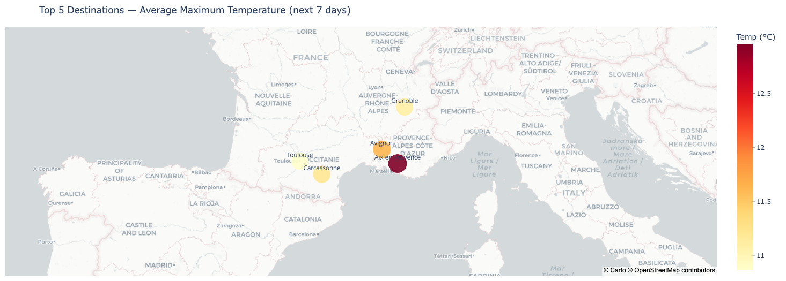
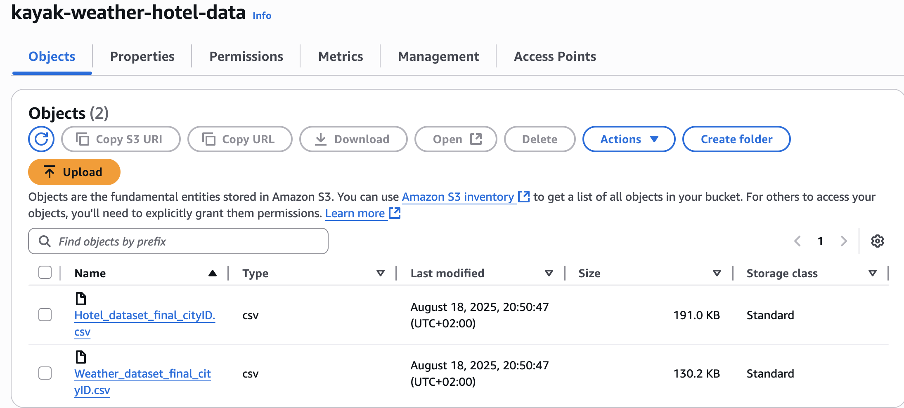

# Kayak — Building a Data Architecture (CDSD · Jedha · Bloc 1)
**Author:** @sonydata

---

## 📄 Description
This project centralizes, cleans, and visualizes **7-day weather** and **hotel** data for French cities.  

Goal: prepare the **data foundation** for an application that helps users decide **where to go** and **which hotels to consider**, using **live data**.

**Previews (clickable)**
- **Destinations (HTML):** https://sonydata.github.io/cdsd-jedha-2025-b01-data-infra-kayak/top5destinations_final.html  
  

- **Hotels (HTML):** https://sonydata.github.io/cdsd-jedha-2025-b01-data-infra-kayak/top_hotels_5cities_layers.html  
  

---

## 🧱 Project architecture
The repo is organized into **2 notebooks** and **1 Python script**:

### 1) `Weather_data_API.ipynb` — **Data acquisition**
- Get **GPS coordinates** for cities via **Nominatim** (OpenStreetMap).
- Pull **7-day daily weather** from **OpenWeather One-Call** (`temp`, `pop`, `rain`, `humidity`, `clouds`, `wind`, …).
- Export results as **CSV** → **`files for S3/`** (Data Lake).

### 2) Booking.com scraping script
- `booking_scraping_final.py`  
  - Extract name, URL, lat/lon, **rating**, **review count**, **amenities**, **neighborhood**, **distance from center**.  
  - Output: `hotels_clean.csv`.  
  - ⚠️ Educational scraping only (polite headers, throttling, low volume).

### 3) `SQLAlchemy.ipynb` — **ETL pipeline (Lake → Warehouse)**
- Load weather + hotel CSVs and **normalize** schemas/types.
- **Merge** weather × hotels using **`City_ID`**; drop duplicate cols; rename leftovers.
- **Load to AWS RDS** 
- Export sample: `hotel_weather_cleaned_data.csv`.  
- Data Lake proof: `S3bucket_content.png`.

### 4) **Interactive maps** — (Colab + HTML in `docs/`)
- **Destinations**: next-week view (Plotly).
- **Hotels**: **Folium** map with **city layer selector**, rich popups (rating, reviews, neighborhood, amenities, distance, Booking link).
- Export **HTML** to `docs/` and publish via **GitHub Pages**.

---

## 🔌 Data sources
- **Geocoding:** Nominatim `/search` → `lat/lon` (no key).  
- **Weather:** OpenWeather **One-Call** (7-day daily).  
- **Hotels (Booking.com):** name, URL, coordinates, rating, reviews, amenities, neighborhood, distance.

---

## 🧰 Technologies & tools
**Python 3.10+**, pandas, numpy, requests, **Plotly**, **Folium**, **SQLAlchemy** · **AWS S3** (Data Lake) & **AWS RDS** (Warehouse) · Nominatim, OpenWeather · `.env` for secrets

---

## 📊 Results
- **Data Lake (S3):** enriched **weather + hotels + `city_id`** → [`files for S3/`](./files%20for%20S3/)  
  
- **Data Warehouse (RDS):** **cleaned, merged** table (sample export) → [`hotel_weather_cleaned_data.csv`](./hotel_weather_cleaned_data.csv)
- **Interactive maps:** published via GitHub Pages  
  - Destinations (HTML): https://sonydata.github.io/cdsd-jedha-2025-b01-data-infra-kayak/top5destinations_final.html  
  - Hotels (HTML): https://sonydata.github.io/cdsd-jedha-2025-b01-data-infra-kayak/top_hotels_5cities_layers.html

---

## ▶️ Next steps
- Compute a **recommendation score** (weather × rating × reviews; optionally price/availability).  
- Add dynamic filters (budget, stars, amenities, date range) and ship a **Streamlit** UI.  
- Schedule a weekly refresh with caching.

> Booking.com data collected **for educational purposes only**, with respectful access patterns (headers, throttling).
